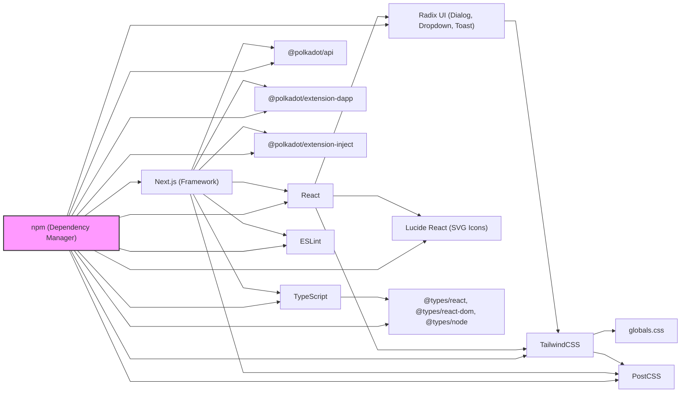

# Advanced Knowledge Base Management - SaaS Platform

## 🎯 Objetivo Principal
Desenvolver uma plataforma SaaS para gestão avançada de base de conhecimento, integrando RAG (Retrieval-Augmented Generation) com consulta direta, focada no ecossistema Polkadot e com potencial para integração com carteiras digitais.

## 🏗️ Arquitetura e Tecnologias
- **Framework**: Next.js 15 com React 19
- **Estilização**: Tailwind CSS 4 (padronizado com polkadot-wallet)
- **Linguagem**: TypeScript
- **Integração**: Polkadot Ecosystem
- **UI Components**: Radix UI + Lucide React
- **Pipeline**: RAG + MCP para dados híbridos

## 📋 Padrões de Desenvolvimento
- **Componentes**: React funcionais com hooks
- **Estilização**: Tailwind CSS com classes utilitárias padronizadas
- **Estrutura**: Organização por funcionalidade SaaS
- **Responsividade**: Mobile-first design
- **Acessibilidade**: Seguir padrões WCAG
- **Automação**: Logs, commits e documentação automática

## 🎨 Diretrizes de Design
- **Interface**: Limpa e minimalista (padrão polkadot-wallet)
- **Cores**: Paleta consistente com identidade Polkadot
- **Tipografia**: Legível e hierárquica
- **Interações**: Feedback visual claro
- **Loading**: Estados de carregamento informativos

## 🔧 Configurações do Ambiente
- **Salvamento**: Automático a cada 5 segundos
- **Versionamento**: Git com commits frequentes
- **Log**: Registro de interações e decisões
- **Linting**: ESLint configurado
- **Automação**: Scripts de log e commit padronizados

## 📁 Estrutura do Projeto
```
Advanced-Knowledge-Base-Management/
├── src/
│   ├── components/     # Componentes reutilizáveis
│   ├── pages/         # Páginas do SaaS
│   ├── styles/        # CSS padronizado
│   └── utils/         # Utilitários (log, commit, etc.)
├── docs/              # Documentação técnica
├── scripts/           # Scripts de automação
├── public/            # Assets estáticos
└── README.md          # Este arquivo
```

## 🚀 Fluxo de Trabalho
1. **Contexto**: Sempre verificar este arquivo antes de começar
2. **Tarefa**: Consultar arquivo de tarefa específica
3. **Desenvolvimento**: Seguir padrões estabelecidos
4. **Log**: Registrar decisões importantes
5. **Commit**: Salvar alterações no Git

## 📝 Notas Importantes
- **Usuário final**: Desenvolvedores e empresas do ecossistema Polkadot
- **Foco**: Simplicidade e usabilidade para gestão de conhecimento
- **Performance**: Carregamento rápido e processamento eficiente
- **Segurança**: Integração segura com APIs e blockchains
- **Escalabilidade**: Arquitetura preparada para crescimento

## 🔗 Integração com Polkadot Wallet
- **Padronização visual**: Mesmo sistema de cores e componentes
- **Autenticação**: Via carteiras Polkadot
- **Cobrança**: Sistema de pagamento em DOT
- **API**: Endpoints para integração futura

## 🛠️ Componentes Reutilizáveis
- **Sistema de Log**: Baseado no log-assistant.js
- **Automação de Commits**: Scripts padronizados
- **Documentação**: Templates e procedimentos
- **UI/UX**: Componentes baseados no polkadot-wallet

## 📊 Métricas de Sucesso
- **Performance**: Tempo de resposta < 2s
- **Usabilidade**: Interface intuitiva
- **Escalabilidade**: Suporte a múltiplos usuários
- **Integração**: Compatibilidade com ecossistema Polkadot

## 🎯 Roadmap
1. **Fase 1**: Estrutura base e componentes
2. **Fase 2**: Pipeline RAG básico
3. **Fase 3**: Integração com APIs Polkadot
4. **Fase 4**: Sistema de autenticação e cobrança
5. **Fase 5**: Integração com polkadot-wallet

---

## Padrão de Automação de Comandos

A partir de agora, **todos os comandos de automação** devem ser executados **um a um**, nunca utilizando `&&` ou comandos compostos, para garantir máxima compatibilidade no ambiente Windows (PowerShell/CMD).

### Exemplo do padrão:
```powershell
git add arquivo.md
git commit -m "feat: descrição da alteração"
node scripts/log-assistant.js "Descrição" "Contexto"
```

## Orientação para Comentários em CSS

**Nunca use comentários de linha `//` em arquivos CSS.**
- Sempre utilize o padrão de comentários de bloco: `/* ... */`
- Comentários de linha causam erro de build e travam o parser CSS

---

**Status do Projeto**: 🟡 Em desenvolvimento inicial
**Última Atualização**: 29/06/2025
**Versão**: 0.1.0

## Passos para garantir o CSS

1. Instale as dependências:
   ```bash
   npm install
   ```
2. Certifique-se de que existe o arquivo postcss.config.mjs na raiz do projeto:
   ```js
   const config = {
     plugins: ["@tailwindcss/postcss"],
   };
   export default config;
   ```
3. Rode o projeto normalmente:
   ```bash
   npm run dev
   ```

## 🛠️ Technical & Operational Guidelines

This SaaS platform leverages a modern stack managed by **npm** (Node Package Manager), which controls the installation, versioning, and integration of all dependencies, ensuring seamless operation and easy updates.

### Main Dependencies
- **@polkadot/api**: Blockchain integration
- **@polkadot/extension-dapp**: Wallet extension connection
- **@polkadot/extension-inject**: Account injection and signing
- **@radix-ui/react-dialog, @radix-ui/react-dropdown-menu, @radix-ui/react-toast**: Accessible UI primitives
- **lucide-react**: SVG icons
- **next**: React framework
- **react**: UI library
- **react-dom**: DOM rendering
- **@tailwindcss/postcss, tailwindcss**: Utility-first CSS
- **typescript, @types/node, @types/react, @types/react-dom**: Type safety
- **eslint**: Code quality

### Dependency Visualization



### Integrity & Customization Directives
- Never modify the source code of external dependencies (Radix UI, TailwindCSS, etc.).
- All UI/UX customizations must be done via TailwindCSS utility classes, project-specific files (e.g., `globals.css`), Tailwind configuration, or React component composition.
- For advanced customization, use wrappers or hooks, but never alter files inside `node_modules`.
- When in doubt, consult this README or the project context documentation before deep customizations.

### For Future Adaptations
This README is designed to help contributors and collaborators understand both the technical context and operational procedures of this SaaS platform. Use it as a reference for future adaptations, forks, or collaborations, ensuring the project remains robust, maintainable, and easy to extend. This project is visually and technically aligned with polkadot-wallet, but is not a direct fork; it shares standards and components for maximum interoperability. 