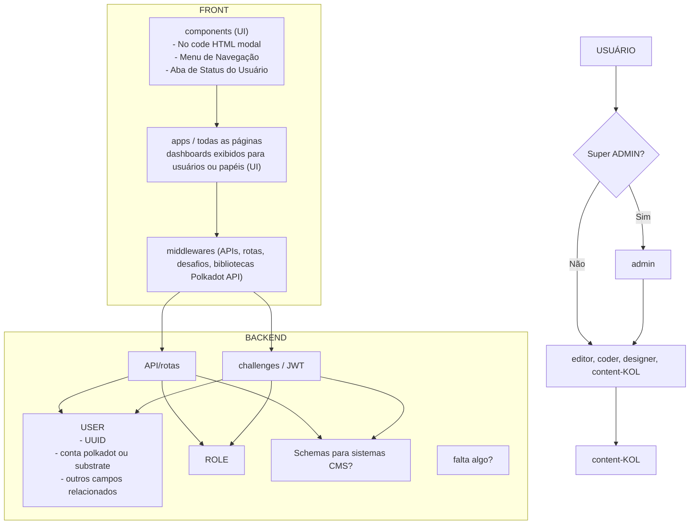
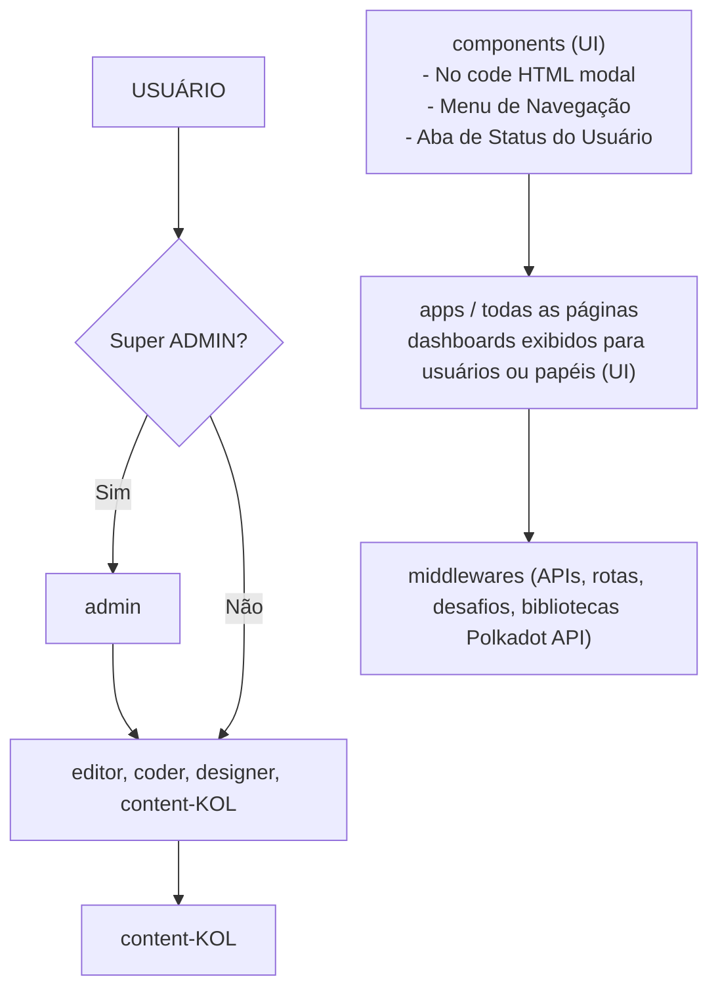
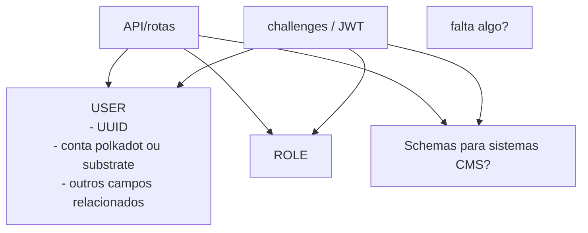

# CMS Criador de Papéis (Roles)

## Objetivo do Produto e Diferencial
Um Headless CMS que permite:

- SaaS = Software como Serviço: Serviço local ou em nuvem que oferece um serviço digital aos usuários.
- O que é um CMS Headless: uma plataforma de gestão de conteúdo para redes sociais, blogs, plataformas de vídeo:
  - YouTube
  - LinkedIn
  - X (Twitter)
  - TikTok
  - Instagram
- WEB3 = Autenticação via Web3

---

## Fluxo de Usuário

### Papéis (Roles):
- **Super Administrador:** Pode modificar permissões de administradores de organizações ou clientes. Exemplo: quando o usuário não pagou, pode desativar o serviço manualmente.
- **Administrador de Organização**
- **Editor**
- **Coder**
- **KOL**
- **Designer**

---

## User Stories

### User Story Organização
Um usuário cria uma página web (instância) e a publica na internet, pertencendo a uma empresa com papéis claros para a gestão do conteúdo dessa página.

**Características:**
- Plataforma no-code, pode modificar sua página com conteúdo multimídia, imagens.
- Uma instância de organização pode ter múltiplos administradores.
- Uma organização pode ter múltiplas instâncias (projetos).
- Cada instância tem papéis definidos, onde o administrador pode atribuir usuários relacionados à sua organização.

### User Story Freelancer
Um usuário cria uma página web (instância), publica na internet e pode administrar ou compartilhar o papel.

**Características:**
- Plataforma no-code, pode modificar sua página com conteúdo multimídia, imagens.
- Pode transferir a instância (projeto) para uma organização, ou continuar administrando enquanto os termos de serviço forem cumpridos.

---

## Diagramas Mermaid

### Diagrama Geral (Front + Backend)

### Diagrama FRONT

### Diagrama BACKEND

---

## Tecnologias Propostas
- PostgreSQL
- ORM (Prisma)

## Autenticação
- JWT
- Polkadot API - desafios

---

## Próximos Passos
- Estabelecer o diagrama Mermaid de conexões do sistema
- Definir o banco de dados com PostgreSQL e Prisma
- Definir sistema de papéis e funções protegidas
- Configurar qual endereço de wallet (o do Eduardo) será o super administrador, e só esse endereço terá acesso a todas as funções
- Conectar a wallet e criar usuários com JWT
- Criar dashboards necessários para os user stories e direcionar os usuários para seus papéis correspondentes 