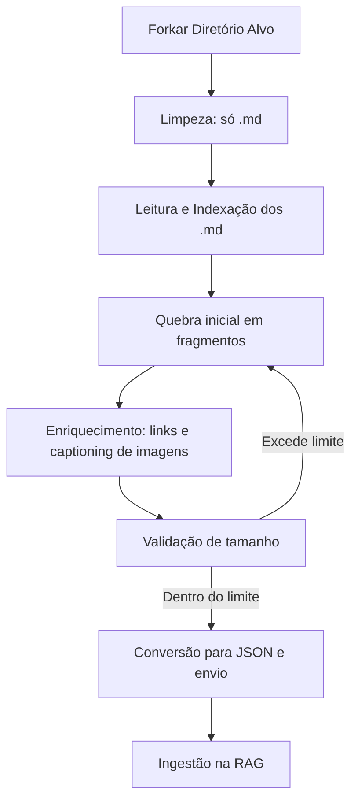

# Documentação Crítica: Pipeline de Leitura e Indexação de Markdown para RAG

## 1. Forkar Diretório Alvo

**Pré-requisitos:**
- Permissão de leitura e escrita no diretório alvo.
- Diretório forkeado do repositório de interesse no GitHub.

**Problema:**  
Nem sempre o repositório original está sob seu controle, então forkar garante independência e rastreabilidade das alterações.

**Solução:**
- Sempre forke o repositório para seu perfil antes de iniciar o pipeline.
- Sincronize periodicamente para manter o conteúdo atualizado.

---

## 2. Leitura e Indexação dos Arquivos Markdown

**Pré-requisitos:**
- Ambiente Node.js ou Python.
- Biblioteca para leitura recursiva de diretórios.

**Problema:**  
Arquivos não Markdown podem poluir o processamento e aumentar o custo computacional.

**Solução:**
- Filtrar e remover todos os arquivos que não sejam `.md`, preservando apenas a estrutura de pastas.
- Adicionar cabeçalho de indexação (tags, título, localização) a cada fragmento para rastreabilidade e busca eficiente.

---

## 3. Quebra Inicial dos Arquivos

**Pré-requisitos:**
- Biblioteca para manipulação de Markdown.
- (Opcional) Acesso a uma LLM para segmentação semântica.

**Problema:**  
Fragmentos muito grandes dificultam a busca e podem exceder limites da RAG; fragmentos muito pequenos perdem contexto.

**Soluções:**
- **Quebra Mecânica:**  
  - Divida por títulos, parágrafos ou blocos de texto.
  - Defina um limite de tamanho (ex: 500-1000 caracteres ou 100-200 tokens).
  - Vantagem: Simples, rápido, baixo custo.
  - Limitação: Pode cortar ideias no meio.
- **Quebra Semântica com LLM:**  
  - Use uma LLM para sugerir pontos de corte mais naturais.
  - Vantagem: Preserva contexto e sentido.
  - Limitação: Mais caro e lento.
- **Estratégia Recomendada:**  
  - Use quebra mecânica como padrão e recorra à LLM apenas para fragmentos problemáticos.

---

## 4. Enriquecimento Semântico de Imagens (Captioning)

**Pré-requisitos:**
- Acesso a uma LLM ou modelo de captioning de imagens (ex: BLIP, GPT-4 Vision).

**Problema:**  
Imagens sem contexto textual são inúteis para a RAG e podem ser ignoradas em buscas.

**Solução:**
- Para cada imagem, gere uma descrição textual (caption) usando uma LLM.
- Inclua o caption no campo `imagens` do fragmento, junto com a URL, posição e alt-text.
- **Desafio:** O caption pode aumentar muito o tamanho do fragmento.
- **Solução:** Se o fragmento ficar grande demais após o enriquecimento, envie-o para nova quebra/refino (ver passo 5).

---

## 5. Validação de Tamanho dos Fragmentos

**Pré-requisitos:**
- Definição clara do limite de tamanho aceito pela RAG (tokens ou bytes).
- Função para contar tokens ou bytes do JSON.

**Problema:**  
Fragmentos grandes demais não podem ser indexados ou consultados eficientemente na RAG.

**Solução:**
- Após enriquecer cada fragmento, valide seu tamanho.
- Se exceder o limite, envie o fragmento para nova quebra/refino (pode ser recursivo).
- Use LLM para sugerir cortes em fragmentos semanticamente densos.

---

## 6. Conversão Final para JSON

**Pré-requisitos:**
- Biblioteca para manipulação de JSON.

**Problema:**  
Estruturas inconsistentes dificultam a ingestão e a busca.

**Solução:**
- Padronize a estrutura do JSON: metadados, conteúdo, links, imagens (com captions).
- Valide o JSON antes de salvar/enviar.

---

## 7. Envio dos Dados

**Pré-requisitos:**
- Permissão de escrita no diretório de integração.
- Biblioteca para escrita de arquivos JSON.

**Problema:**  
Latência ou falhas no envio podem causar perda de dados.

**Solução:**
- Implemente retries e logs de erro.
- Use escrita atômica para evitar arquivos corrompidos.

---

## 8. Integração com RAG

**Pré-requisitos:**
- Pipeline de ingestão configurado.
- Permissão de leitura no diretório de integração.

**Problema:**  
A ingestão pode falhar se o formato não for compatível ou se houver fragmentos grandes demais.

**Solução:**
- Teste a ingestão com amostras antes de produção.
- Implemente logs e alertas para falhas de ingestão.

---

## 9. Pontos de Atenção e Melhorias Futuras

**Problemas e Soluções:**
- **Links e Imagens:**  
  - Problema: Contexto pode ser perdido.
  - Solução: Sempre inclua posição e contexto textual no JSON.
- **Performance:**  
  - Problema: Grandes volumes podem travar o pipeline.
  - Solução: Use streams, processamento incremental e paralelismo.
- **Extensibilidade:**  
  - Problema: Novos formatos ou integrações.
  - Solução: Modularize o pipeline e documente cada etapa.

---

## 10. Pipeline Adaptativo (Fluxo)

---

## 11. Conclusão

Este pipeline crítico garante que o conhecimento em Markdown seja transformado em dados estruturados, semanticamente enriquecidos (inclusive imagens), e prontos para indexação eficiente em sistemas RAG, respeitando limites de tamanho e contexto.  
Cada etapa foi pensada para mitigar os principais problemas práticos de ingestão, garantindo robustez, performance e extensibilidade.

Se quiser exemplos de código para cada etapa, posso detalhar a implementação! 