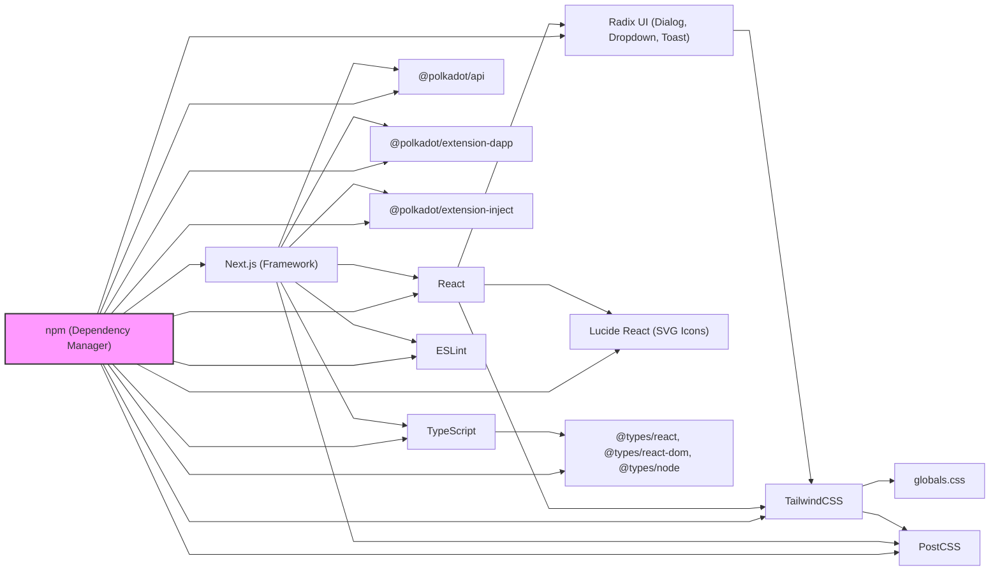

# Dialogue Summary – Project Guidelines & Technical Decisions

## About this Report
This document is both a technical and strategic report. It summarizes a detailed dialogue aimed at clarifying the current state of our product family, the legacy built so far, and the decision-making process for the next steps. The goal is to provide a clear reference for collaborators, ensuring everyone understands not only the technical context but also the reasoning behind our operational and strategic choices.

## Context
This document summarizes the technical and operational decisions made during today's conversation, starting from the translation of the CMS Roles Creator document to Portuguese, through the analysis of UI/UX customization practices, and ending with the establishment of project guidelines and operational procedures.

---

## 1. Translation and Documentation
- The original CMS Roles Creator document was translated into Portuguese, including all user stories, technical requirements, and Mermaid diagrams for system architecture.
- The translated document is currently under review by Eduardo Cardoso.
- The translated document is ready to serve as a technical and functional reference for the development of a headless CMS integrated with Polkadot-wallet and/or Advanced-Knowledge-Base-Management.

## 2. Technical Stack Analysis
- **Radix UI** ([official site](https://www.radix-ui.com/)) is a library of unstyled, accessible interface primitives (dialogs, dropdowns, toasts, etc.) integrated via React imports. It provides the behavior and accessibility, but not the visual style.
- **TailwindCSS** ([official site](https://tailwindcss.com/)) is used for utility-first styling, allowing rapid prototyping and consistent design through utility classes in JSX. Tailwind acts as the "glue" between Radix UI primitives and the project's global styles defined in `globals.css`, enabling seamless visual integration and customization.
- **globals.css** is used for global styles, resets, and custom rules that complement Tailwind and are not easily covered by utility classes.
- **npm** (Node Package Manager) controls the flow of communication and integration between these libraries. It manages the installation, versioning, and updates of Radix UI, TailwindCSS, and all other dependencies, ensuring that the correct versions are used and that all packages work together seamlessly within the project.
- All customizations are performed via Tailwind classes, configuration files, or project-specific CSS, never by modifying the source code of external dependencies.

### Main Project Dependencies

- **@polkadot/api**: Connects and interacts with the Polkadot blockchain, enabling queries, transactions, and on-chain data access.
- **@polkadot/extension-dapp**: Facilitates communication between the web app and Polkadot wallet browser extensions for authentication and account access.
- **@polkadot/extension-inject**: Supports account injection and signing features from Polkadot extensions.
- **@radix-ui/react-dialog, @radix-ui/react-dropdown-menu, @radix-ui/react-toast**: Accessible, unstyled UI primitives for dialogs, dropdowns, and toasts.
- **lucide-react**: SVG icon library for React, used for modern, customizable icons.
- **next**: React framework for SSR, SSG, routing, and performance optimizations.
- **react**: Main library for building user interfaces with components.
- **react-dom**: Renders React components to the browser DOM.
- **@eslint/eslintrc, eslint, eslint-config-next**: Linting tools for code quality and consistency.
- **@tailwindcss/postcss, tailwindcss**: Utility-first CSS framework and its processor.
- **typescript, @types/node, @types/react, @types/react-dom**: TypeScript and type definitions for static typing and code safety.

### Visualizing Dependencies

To visualize the relationship between dependencies in this project, you can use a Mermaid diagram with straight, angular lines by adding the following configuration at the top:

This configuration ensures all lines are straight and angular, and the diagram now clearly shows npm as the central manager of all dependencies, illustrating its role in controlling installation, versioning, and integration.

## 3. Integrity Directives
- Never modify the source code of external dependencies (Radix UI, TailwindCSS, etc.).
- All UI/UX customizations must be done via:
  - TailwindCSS utility classes
  - Project-specific files (e.g., `globals.css`)
  - Tailwind configuration (`tailwind.config.ts`)
  - Component composition and React wrappers
- If advanced customization is needed, use wrappers or hooks, but never alter files inside `node_modules`.
- When in doubt, consult the project context documentation or ask for guidance before attempting deep customizations.

## 4. Applicability of the CMS Document
- The translated CMS Roles Creator document is suitable to be used as a base for building the new application, either on top of Polkadot-wallet or Advanced-Knowledge-Base-Management (currently a copy of Polkadot-wallet).
- The document is compatible with the current stack and project standards.
- It provides clear user stories, technical requirements, and architectural diagrams for implementation.

## 5. Operational Recommendations
- Review the translated CMS document to ensure all terms and flows fit the real project context.
- Adapt the document if Advanced-Knowledge-Base-Management evolves beyond a copy of Polkadot-wallet.
- Use the document as a reference for creating tasks, issues, and PRs.
- Keep the documentation updated as the project evolves.

---

## 📋 Task – Documentation and Guidelines

| Task | Status | Project |
|------|--------|---------|
| Create and commit README summarizing today's technical dialogue, decisions, and operational guidelines | 🟢 Done | Polkadot-wallet / Advanced-Knowledge-Base-Management |

---

## How to Proceed
1. Use this README as a reference for all team members.
2. Follow the integrity and customization guidelines strictly.
3. Use the translated CMS document as a technical and functional base for the new application.
4. Update this documentation as new decisions are made.
5. Incorporate the content of this report into the README files of both the Polkadot-wallet and Advanced-Knowledge-Base-Management projects. The overall goal is to keep the README of both projects ready so that people can not only understand their particular contexts but also have a clear idea of how to proceed technically for future adaptations (collaborations, forks, etc.).

---

**If you have any questions or need to make deep customizations, always consult the context documentation or ask for guidance before proceeding.**

---

## Future Actions
- Await the review and feedback from Eduardo Cardoso on the translated CMS Roles Creator document.
- Incorporate any suggested changes or improvements after the review.
- Proceed with implementation and further documentation updates as needed.

---

## Product Family Strategy & Next Steps

We are building a family of complementary products for different but related use cases:

- **Polkadot Wallet**: Targeted at developers who are starting with the Polkadot ecosystem and need a quick start for hackathons, prototyping, and new application development. It is simple, focused, and ideal for onboarding and rapid integration with wallets.

- **Advanced-Knowledge-Base-Management**: Designed for SaaS, advanced knowledge management, and integration with Polkadot. It is also the natural base for a future CMS with intensive AI usage. This project is ready to evolve beyond its initial purpose, supporting both its original goals and the creation of a robust, AI-powered CMS.

### Analysis: Which Base to Use for the CMS?

- **Use Polkadot Wallet as CMS base if:**
  - The goal is a simple, fast CMS for prototyping or hackathons.
  - You want minimal dependencies and a lightweight structure.
  - The focus is on wallet integration and a quick learning curve.

- **Use Advanced-Knowledge-Base-Management as CMS base if:**
  - The goal is a robust, scalable CMS with AI, multi-user support, and SaaS features.
  - You need advanced automation, logging, and integration with knowledge pipelines.
  - You want to leverage an architecture already prepared for complex use cases.

### Current Similarities
- Both use Next.js, TailwindCSS, Radix UI, TypeScript, and Polkadot integration.
- Both share design standards, component structure, and development guidelines.
- Both are designed for reusability and adaptability.

### Current Differences
- **Polkadot Wallet:** Focused on wallet, onboarding, simplicity, and documentation for beginners.
- **Advanced-Knowledge-Base-Management:** Focused on SaaS, knowledge management, automation, AI integration, multi-user, logging, and scalability.

### Recommendations
- Maintain both projects, each with its own focus, but with shared standards and components for maximum interoperability.
- Use the README of each project as a living reference for context, technical adaptation, collaboration, and future forks.
- Make decisions about the CMS base according to the intended use case and required complexity.

---

This report is intended to guide both technical implementation and strategic planning, ensuring that all collaborators have a clear understanding of the current landscape and the rationale behind future decisions. 