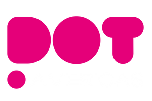

<div align="center">
  
</div>

# Polkadot Wallet Framework

> A rapid-start framework for Polkadot ecosystem onboarding and educational initiatives

[](https://nextjs.org/)
[](https://www.typescriptlang.org/)
[](https://tailwindcss.com/)
[](https://polkadot.network/)
[](https://opensource.org/licenses/MIT)

## 🌟 About

**Polkadot Wallet Framework** is an educational initiative by **DAO DOT Americas**, a Decentralized Autonomous Organization operating within the Polkadot Network. Our mission is to facilitate the onboarding of new talent into the Polkadot ecosystem through educational tools and rapid-start frameworks.

This application is designed to serve multiple purposes within the Polkadot ecosystem:

• **Comprehensive Starting Point**: Provides developers with a complete foundation for Polkadot development
• **Educational Resource**: Explains core concepts to enthusiasts and newcomers
• **Framework Foundation**: Enables the creation of derivative applications
• **Community Building**: Fosters vibecode initiatives within the Polkadot community

## 👥 Creators

This project is developed by:

- **Eduardo Cardoso** - Co-founder of Upsize and DOT Americas
- **Edgar Peranto** - Member of DOT Americas

Both creators host the **DOTVIBEZ** program, a weekly educational show that airs on DOT Americas social media platforms, bringing the latest insights and developments from the Polkadot ecosystem.

## 🎯 Mission

Our mission is to democratize access to Polkadot development and education through innovative tools and community-driven initiatives. We focus on:

• **Educational Framework**: Provide developers with a rapid-start environment for Polkadot development
• **Concept Explanation**: Help enthusiasts understand Polkadot ecosystem concepts  
• **Derivative Applications**: Enable the creation of new applications based on this framework
• **Community Growth**: Foster vibecode initiatives and talent development in the Polkadot network

## 🚀 Features

### 🔗 Wallet Integration
- **Multi-Wallet Support**: Connect with Polkadot.js, Nova, Talisman, and SubWallet extensions
- **Real-time Balance**: Live DOT balance display with USD conversion
- **Secure Authentication**: Web3-based authentication using Polkadot wallet signatures
- **Network Status**: Real-time connection status to Polkadot network

### 🎨 Modern Interface
- **Responsive Design**: Optimized for desktop and mobile devices
- **Dark/Light Theme**: Adaptive theme switching
- **Professional UI**: Built with Tailwind CSS and Radix UI components
- **Accessibility**: WCAG compliant interface components

### 🛠️ Developer Experience
- **TypeScript**: Full type safety and better development experience
- **Next.js 15**: Latest React framework with App Router
- **Hot Reload**: Instant development feedback
- **ESLint**: Code quality and consistency
- **Auto-save**: Never lose your work

## 🏗️ Architecture

### Tech Stack
- **Framework**: [Next.js 15](https://nextjs.org/) with App Router
- **Language**: [TypeScript](https://www.typescriptlang.org/)
- **Styling**: [Tailwind CSS](https://tailwindcss.com/)
- **UI Components**: [Radix UI](https://www.radix-ui.com/)
- **Blockchain**: [Polkadot.js API](https://polkadot.js.org/)
- **Icons**: [Lucide React](https://lucide.dev/)

### Project Structure
```
polkadot-wallet/
├── src/
│   ├── app/                    # Next.js App Router pages
│   │   ├── page.tsx           # Main wallet interface
│   │   ├── quem-somos/        # About page
│   │   ├── o-que-fazemos/     # What we do page
│   │   ├── faq/              # FAQ page
│   │   └── contato/          # Contact page
│   ├── components/            # Reusable React components
│   │   ├── WalletConnect.tsx # Main wallet connection component
│   │   ├── Header.tsx        # Navigation header
│   │   ├── Footer.tsx        # Site footer
│   │   ├── NetworkSelector.tsx # Network selection
│   │   └── DashboardStats.tsx # Statistics display
│   └── globals.css           # Global styles
├── public/                   # Static assets
│   └── images/              # Images and logos
├── package.json             # Dependencies and scripts
├── next.config.ts           # Next.js configuration
├── tailwind.config.ts       # Tailwind CSS configuration
└── tsconfig.json           # TypeScript configuration
```

## 🚀 Quick Start

### Prerequisites

- Node.js 18+ 
- npm or yarn
- Git

### Installation

```bash
# Clone the repository
git clone https://github.com/your-username/polkadot-wallet.git

# Navigate to the project
cd polkadot-wallet

# Install dependencies
npm install

# Start development server
npm run dev
```

Visit [http://localhost:3000](http://localhost:3000) to see the application.

## 🛠️ Tech Stack

- **Framework**: [Next.js 15](https://nextjs.org/) with App Router
- **Language**: [TypeScript](https://www.typescriptlang.org/)
- **Styling**: [Tailwind CSS](https://tailwindcss.com/)
- **Blockchain**: [Polkadot.js](https://polkadot.js.org/)
- **Deployment**: Vercel-ready

## 📚 Educational Resources

- [Polkadot Network Documentation](https://wiki.polkadot.network/)
- [Substrate Developer Hub](https://docs.substrate.io/)
- [Polkadot.js API](https://polkadot.js.org/docs/api/)
- [DOTVIBEZ Program](https://x.com/polkadotamerica) - Weekly educational content

## 🤝 Contributing

We welcome contributions from the community! Please read our contributing guidelines:

1. Fork the repository
2. Create a feature branch (`git checkout -b feature/amazing-feature`)
3. Commit your changes (`git commit -m 'Add amazing feature'`)
4. Push to the branch (`git push origin feature/amazing-feature`)
5. Open a Pull Request

### Development Guidelines

- Follow TypeScript best practices
- Use Tailwind CSS for styling
- Write meaningful commit messages
- Test your changes thoroughly
- Update documentation as needed

## 📄 License

This project is licensed under the **MIT License** - see the [LICENSE](LICENSE) file for details.

The MIT License is chosen for its simplicity and permissiveness, making it ideal for educational projects and derivative applications within the Polkadot ecosystem.

## 🌐 Community

- **DOT Americas**: [X (Twitter)](https://x.com/polkadotamerica)
- **DOTVIBEZ Program**: Weekly educational content on DOT Americas social media
- **Polkadot Network**: [Official Website](https://polkadot.network/)
- **Discussions**: [GitHub Issues](https://github.com/your-username/polkadot-wallet/issues)

## 🙏 Acknowledgments

- **Web3 Foundation** for the Polkadot ecosystem
- **Parity Technologies** for Substrate framework
- **DAO DOT Americas** community members
- **Polkadot.js** team for the excellent API
- **Eduardo Cardoso** and **Edgar Peranto** for their leadership in the DOTVIBEZ program

## 📞 Support

For support and questions:

- **Community**: Follow [DOT Americas on X](https://x.com/polkadotamerica)
- **DOTVIBEZ**: Watch our weekly educational program
- **Issues**: [GitHub Issues](https://github.com/your-username/polkadot-wallet/issues)
- **Documentation**: [Project Wiki](https://github.com/your-username/polkadot-wallet/wiki)

---

**Made with ❤️ by Eduardo Cardoso & Edgar Peranto for the Polkadot ecosystem**

*Part of the DOTVIBEZ educational initiative by DAO DOT Americas*
