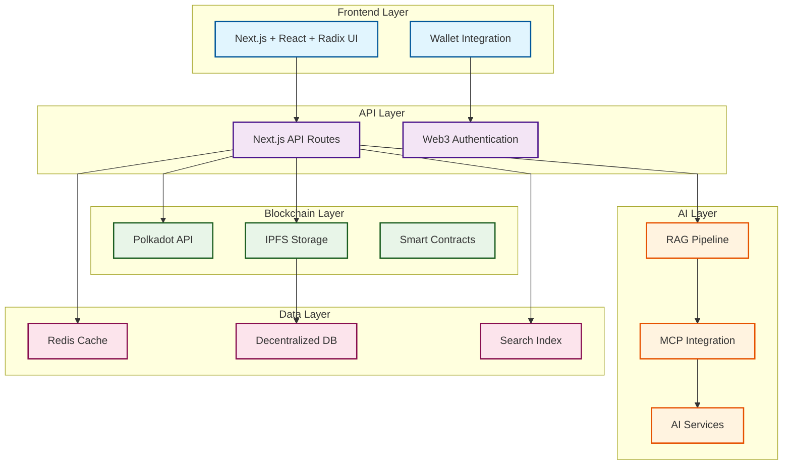
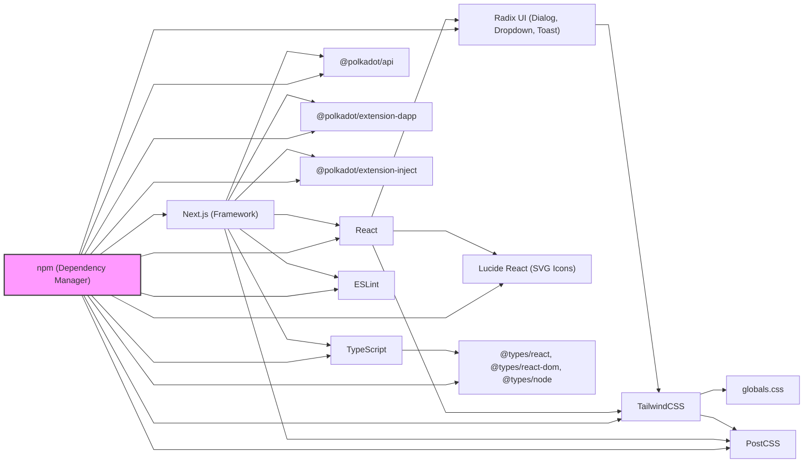
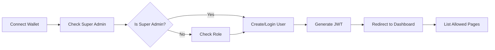

# CMS WEB3 - Polkadot CMS
## Complete Project Documentation

---

## 📋 Index
1. [Reasons for a WEB3 CMS](#reasons-for-a-web3-cms)
2. [Product Objective and Differentiator](#product-objective-and-differentiator)
3. [Business Models](#business-models)
4. [System Architecture](#system-architecture)
5. [Detailed Use Cases](#detailed-use-cases)
6. [Competitive Comparison](#competitive-comparison)
7. [Development Roadmap](#development-roadmap)
8. [Success Metrics](#success-metrics)
9. [Risks and Mitigations](#risks-and-mitigations)
10. [Governance and Community](#governance-and-community)
11. [Technical Stack](#technical-stack)
12. [Constructive Approach](#constructive-approach)

---

## 🎯 Reasons for a WEB3 CMS

Approximately 64-65% of websites use a CMS as part of their structure. Largely based on Web2 structures, they face inherent limitations:

### ❌ Problems with Traditional (Web2) CMS

- **Poor Source Verification:** Lack of robust mechanisms to authenticate content origin, facilitating the spread of Fake News.
- **Misuse of Data:** Web2 structures often treat the user as a product, exploiting and monetizing personal data without full consent.
- **Prior Censorship:** Centralized CMSs are susceptible to censorship, often prior, allowing content removal and tampering by governments or corporations.
- **Compromised Digital Archaeology:** Significant risk of loss and manipulation of historical content records.
- **Lack of Transparency:** Absence of transparency and immutable records in content transactions and management.
- **Weakened Security:** Centralized systems are more vulnerable to cyberattacks, exposing sensitive data.

### ✅ Opportunities and Solutions with Web3 CMS

- **Content Ownership:** Empowers users with direct and proprietary control over their content.
- **Transaction Transparency:** Uses blockchain to ensure immutable records and verifiable authentication.
- **Native Payment Methods:** Blockchain provides a secure and efficient structure for transactions without intermediaries.
- **Economic Incentives:** Introduction of reward systems using tokens, fairly incentivizing content creators.
- **Greater Security:** Decentralized structure enhances security against cyberattacks.
- **Advanced Interoperability:** Polkadot architecture enables effective, low-cost communication between various decentralized networks.
- **Structural Resilience:** Distributed implementation ensures constant content availability and integrity.
- **Encrypted Content:** Native encryption ensures data protection and compacts large volumes of information into secure hashes.

### 🚀 Present and Near Future

- **AI Integration:** Use of artificial intelligence for enhanced personalization, automation, and content analysis.
- **Headless CMS:** Increased flexibility through decoupling the front-end from the back-end, allowing content dissemination across multiple platforms and devices.
- **Data Cross-Referencing via APIs and MCPs:** Integration and cross-referencing of data from multiple sources through APIs (Application Programming Interfaces) encapsulated in MCPs (Anthropic Standard), enabling the creation of unprecedented services.

---

## 🎯 Product Objective and Differentiator

### Main Features

- **SaaS - Software as a Service:** Local or cloud service offering a digital service to users.
- **Open Source:** The project grows organically without relying on a centralizing entity or corporation, and should include a community of developers, enthusiasts, and non-technical users.
- **Headless:** Can be used as an output hub in multiple formats, enhanced by intensive AI use (a parent content can be reprocessed into countless child contents).
- **WEB3 Authentication:** Provides native infrastructure for a CMS to be forced into multiple use cases such as EAD platforms, E-commerce, Institutional Sites, Small Business Sites, DAO Platforms, Forums, Intranets (with controlled subscription flows), Consultation Systems and Public Services, Authentication Platforms (for document registration), etc.

### Competitive Differentiator

- **First native Web3 CMS** on the Polkadot network
- **Native AI integration** with RAG and MCP
- **Decentralized governance** via DAO
- **Tokenized ecosystem** for incentives
- **Cross-chain interoperability** via Polkadot

---

## 💰 Business Models (Maturation Possibilities)

### Model 1 - Cloud White Label
- **Description:** Enables easy use with abstraction of own server management
- **Revenue:** Based on staking of own token for use (benchmark: aixbt - https://x.com/aixbt_agent) + revenue from micro-taxation
- **Advantages:** Low entry barrier, automatic scalability
- **Audience:** Startups and small businesses

### Model 2 - Own Server White Label
- **Description:** Allows other installations to exist and individuals to engage in the community as consultants and/or sellers of customized solutions from the platform itself (benchmark: Linux)
- **Revenue:** Encrypted authorizations (creating a kind of reputation seal - NFT - that ensures quality and standardization of services)
- **Advantages:** Greater control, active community
- **Audience:** Medium and large companies, consultants

### Model 3 - Retail with Expandable Packages
- **Description:** Same revenue model as Business Model 1, but with predefined packages
- **Revenue:** Monthly/annual subscriptions + micro-taxation
- **Advantages:** Revenue predictability, easy onboarding
- **Audience:** Freelancers and small businesses

### Model 4 - Advertiser Network
- **Description:** Benchmark Brave Browser - https://www.youtube.com/watch?v=aM-5SPDPtjE
- **Revenue:** Non-intrusive ads, revenue sharing with users
- **Advantages:** Sustainable model, benefits users
- **Audience:** Content creators, advertisers

---

## 🏗️ System Architecture

### Main Components



### Data Flow

1. **Authentication:** User connects wallet → On-chain verification → Session created
2. **Content Creation:** Editor → Validation → Encryption → IPFS Upload → Hash on blockchain
3. **Distribution:** Content → Cache → CDN → Multiple platforms
4. **Monetization:** Interaction → Smart contract → Automatic payment

---

## 📱 Detailed Use Cases

### 1. Web3 EAD Platform
- **Problem:** Forged certificates, unverified content, centralization
- **Solution:** NFT certificates, immutable content on blockchain, instant verification
- **Benefits:** No forgery, automatic verification, user ownership
- **Implementation:** Smart contracts for certificates, IPFS for content

### 2. Decentralized E-commerce
- **Problem:** Intermediaries, high fees, centralized data, censorship
- **Solution:** Smart contracts, direct payments, user data, no intermediaries
- **Benefits:** Lower fees, more transparency, no censorship
- **Implementation:** P2P marketplace, payments in DOT, immutable reviews

### 3. DAO Platform
- **Problem:** Centralized governance, lack of transparency, low participation
- **Solution:** On-chain governance, immutable proposals, transparent voting
- **Benefits:** Total transparency, incentivized participation, automatic execution
- **Implementation:** Proposal system, token voting, execution via smart contracts

### 4. Government Institutional Sites
- **Problem:** Censorship, data manipulation, lack of transparency
- **Solution:** Immutable content, origin verification, total transparency
- **Benefits:** No censorship, verifiable data, public trust
- **Implementation:** Content on blockchain, digital signatures, public audit

### 5. Document Authentication Platform
- **Problem:** Forged documents, slow verification, high costs
- **Solution:** NFTs for documents, instant verification, low costs
- **Benefits:** No forgery, fast verification, minimal costs
- **Implementation:** Document hash on blockchain, verification via API

---

## 📊 Competitive Comparison

| Aspect | WordPress | Webflow | Wix | Polkadot-CMS |
|---------|-----------|---------|-----|--------------|
| **Decentralization** | ❌ | ❌ | ❌ | ✅ |
| **Content Ownership** | ❌ | ❌ | ❌ | ✅ |
| **Native Payments** | ❌ | ❌ | ❌ | ✅ |
| **Censorship** | Vulnerable | Vulnerable | Vulnerable | Resistant |
| **Costs** | Variable | High | Medium | Low |
| **Performance** | Low | High | Medium | High |
| **Security** | Medium | High | Medium | Very High |
| **Interoperability** | Low | Medium | Low | Very High |
| **Governance** | Centralized | Centralized | Centralized | Decentralized |
| **Tokenized Incentives** | ❌ | ❌ | ❌ | ✅ |

---

## 🗺️ Development Roadmap

### Phase 1: MVP (3 months)
- [ ] **Basic Web3 Authentication**
  - Polkadot wallet integration
  - Session system
  - On-chain verification
- [ ] **Simple content editor**
  - Basic WYSIWYG editor
  - Image upload to IPFS
  - Real-time preview
- [ ] **Basic IPFS storage**
  - File upload
  - Hash on blockchain
  - Content retrieval
- [ ] **Basic interface**
  - Simple dashboard
  - Content listing
  - Basic settings

### Phase 2: Core Features (6 months)
- [ ] **Template system**
  - Responsive templates
  - Advanced customization
  - Template marketplace
- [ ] **Complete Polkadot integration**
  - Smart contracts for payments
  - Reputation system
  - Basic governance
- [ ] **Payment system**
  - Payments in DOT
  - Micro-transactions
  - Subscription system
- [ ] **Public API**
  - Complete REST API
  - Interactive documentation
  - SDKs for multiple languages

### Phase 3: AI and Automation (9 months)
- [ ] **RAG integration**
  - Semantic search
  - Smart recommendations
  - Content analysis
- [ ] **Content automation**
  - Automatic generation
  - SEO optimization
  - Dynamic personalization
- [ ] **Predictive analysis**
  - Advanced metrics
  - Behavior insights
  - Automatic optimization
- [ ] **Advanced personalization**
  - AI for UX
  - Personalized recommendations
  - Automatic A/B testing

### Phase 4: Ecosystem (12 months)
- [ ] **Marketplace**
  - Premium templates
  - Plugins and extensions
  - Third-party services
- [ ] **DAO Governance**
  - Voting system
  - Improvement proposals
  - Token distribution
- [ ] **Interoperability**
  - Cross-chain integration
  - Bridges to other networks
  - Open standards
- [ ] **Scalability**
  - Automatic sharding
  - Decentralized CDN
  - Optimized performance

---

## 📈 Success Metrics

### Technical Metrics
- **Performance:** Load time < 2s
- **Availability:** 99.9% uptime
- **Security:** Zero critical vulnerabilities
- **Scalability:** Support for 1M+ simultaneous users

### Business Metrics
- **Adoption:** 1000+ active users in 6 months
- **Revenue:** $50k+ ARR in 12 months
- **Community:** 100+ open source contributors
- **Partnerships:** 10+ integrations with Polkadot projects

### Product Metrics
- **Engagement:** 70%+ monthly retention
- **Satisfaction:** 4.5+ stars in reviews
- **Growth:** 20%+ monthly growth
- **Quality:** < 1% critical bug rate

---

## ⚠️ Risks and Mitigations

### Technical Risks

| Risk | Probability | Impact | Mitigation |
|------|-------------|--------|------------|
| **Scalability** | Medium | High | Implement sharding and caching |
| **Interoperability** | Low | Medium | Extensive testing with parachains |
| **Performance** | Medium | High | Continuous optimization and CDN |
| **Security** | Low | Critical | Regular audits and bug bounties |

### Business Risks

| Risk | Probability | Impact | Mitigation |
|------|-------------|--------|------------|
| **Adoption** | Medium | High | Early adopter program |
| **Competition** | High | Medium | Clear differentiation and strong community |
| **Regulation** | Low | High | Compliance from the start |
| **Market** | Medium | Medium | Diversification of use cases |

### Product Risks

| Risk | Probability | Impact | Mitigation |
|------|-------------|--------|------------|
| **UX/UI** | Medium | High | Continuous user testing |
| **Features** | Low | Medium | Flexible roadmap and feedback |
| **Integration** | Medium | Medium | Well-documented APIs |
| **Support** | Low | High | Scalable support system |

---

## 🏛️ Governance and Community

### Governance Model

- **DAO:** Technical and product decisions via on-chain voting
- **Token:** $PCMS for governance and incentives
- **Proposals:** Voting system with minimum quorum
- **Execution:** Smart contracts for automatic execution

### Contribution Program

- **Bounties:** Rewards for features and fixes
- **Hackathons:** Quarterly events with prizes
- **Documentation:** Reward system for improvements
- **Translation:** Incentives for localization

### Community Structure

- **Developers:** Technical contributions and reviews
- **Designers:** UX/UI improvements and templates
- **Evangelists:** Outreach and onboarding
- **Users:** Feedback and use cases

### Tokenized Incentives

- **Contributions:** Tokens for approved PRs
- **Governance:** Token voting
- **Staking:** Participation rewards
- **Liquidity:** Incentives for liquidity providers

---

## 🛠️ Technical Stack

### Radix UI
[Official site](https://www.radix-ui.com/) is a library of unstyled, accessible interface primitives (dialogs, dropdowns, toasts, etc.) integrated via React imports. It provides the behavior and accessibility, but not the visual style.

### TailwindCSS
[Official site](https://tailwindcss.com/) is used for utility-first styling, allowing rapid prototyping and consistent design through utility classes in JSX. Tailwind acts as the "glue" between Radix UI primitives and the project's global styles defined in `globals.css`, enabling seamless visual integration and customization.

### globals.css
Is used for global styles, resets, and custom rules that complement Tailwind and are not easily covered by utility classes.

### npm
(Node Package Manager) controls the flow of communication and integration between these libraries. It manages the installation, versioning, and updates of Radix UI, TailwindCSS, and all other dependencies, ensuring that the correct versions are used and that all packages work together seamlessly within the project.

All customizations are performed via Tailwind classes, configuration files, or project-specific CSS, never by modifying the source code of external dependencies.

### Main Project Dependencies

- **@polkadot/api**: Connects and interacts with the Polkadot blockchain, enabling queries, transactions, and on-chain data access.
- **@polkadot/extension-dapp**: Facilitates communication between the web app and Polkadot wallet browser extensions for authentication and account access.
- **@polkadot/extension-inject**: Supports account injection and signing features from Polkadot extensions.
- **@radix-ui/react-dialog, @radix-ui/react-dropdown-menu, @radix-ui/react-toast**: Accessible, unstyled UI primitives for dialogs, dropdowns, and toasts.
- **lucide-react**: SVG icon library for React, used for modern, customizable icons.
- **next**: React framework for SSR, SSG, routing, and performance optimizations.
- **react**: Main library for building user interfaces with components.
- **react-dom**: Renders React components to the browser DOM.
- **@eslint/eslintrc, eslint, eslint-config-next**: Linting tools for code quality and consistency.
- **@tailwindcss/postcss, tailwindcss**: Utility-first CSS framework and its processor.
- **typescript, @types/node, @types/react, @types/react-dom**: TypeScript and type definitions for static typing and code safety.

### Visualizing Dependencies

To visualize the relationship between dependencies in this project, you can use a Mermaid diagram with straight, angular lines by adding the following configuration at the top:



This configuration ensures all lines are straight and angular, and the diagram now clearly shows npm as the central manager of all dependencies, illustrating its role in controlling installation, versioning, and integration.

---

## 🚀 Constructive Approach

### Vibecode Method
**Cursor Platform** - https://cursor.com/
Enables coding with integrated AI - High speed of analysis, execution, and task control.

### Development Methodology
- **Agile/Scrum:** 2-week sprints with incremental deliveries
- **TDD:** Test-Driven Development for code quality
- **CI/CD:** Continuous integration and deployment
- **Code Review:** Mandatory reviews for all PRs

### Development Tools
- **IDE:** Cursor with integrated AI
- **Versioning:** Git with GitFlow
- **Documentation:** Markdown + Mermaid
- **Communication:** Discord + GitHub Discussions

---

## 📝 Next Steps

1. **Create visual prototypes** of main features
2. **Develop MVP** with basic features
3. **Establish partnerships** with Polkadot projects
4. **Build a community** of early adopters
5. **Implement continuous feedback system**
6. **Develop marketing and adoption strategy**

---

## 🚀 MVP Implementation - 2 Hours

### Rapid Development Strategy

**Approach:** Implement roles as access records to pages, with business rules for future implementation.

### Role Structure (Complete)
- **Super Administrator:** Can modify permissions of organization or client administrators
- **Organization Administrator**
- **Content Creator**
- **Editor**
- **Coder**
- **Designer**

### Focus User Stories

#### Organization User Story
A user creates a web page (instance) and publishes it on the internet, belonging to a company with clear roles for managing that page's content.

**Features:**
- No-code platform, can modify their page with multimedia content, images
- An organization instance can have multiple administrators
- An organization can have multiple instances (projects)
- Each instance has defined roles, where the administrator can assign users related to their organization

#### Freelancer User Story
A user creates a web page (instance), publishes it on the internet, and can manage or share the role.

**Features:**
- No-code platform, can modify their page with multimedia content, images
- Can transfer the instance (project) to an organization, or continue managing it as long as the terms of service are met

### Database Structure (MVP)

```sql
-- Essential tables for MVP
users (
    id UUID PRIMARY KEY,
    wallet_address VARCHAR(255) UNIQUE NOT NULL,
    role_id UUID REFERENCES roles(id),
    organization_id UUID REFERENCES organizations(id),
    created_at TIMESTAMP DEFAULT NOW()
)

roles (
    id UUID PRIMARY KEY,
    name VARCHAR(100) NOT NULL,
    allowed_pages TEXT[], -- Array of allowed pages
    created_at TIMESTAMP DEFAULT NOW()
)

organizations (
    id UUID PRIMARY KEY,
    name VARCHAR(255) NOT NULL,
    owner_wallet VARCHAR(255) NOT NULL,
    created_at TIMESTAMP DEFAULT NOW()
)

instances (
    id UUID PRIMARY KEY,
    name VARCHAR(255) NOT NULL,
    organization_id UUID REFERENCES organizations(id),
    content JSONB, -- Instance content
    created_at TIMESTAMP DEFAULT NOW()
)

user_sessions (
    id UUID PRIMARY KEY,
    user_id UUID REFERENCES users(id),
    jwt_token TEXT NOT NULL,
    expires_at TIMESTAMP NOT NULL,
    created_at TIMESTAMP DEFAULT NOW()
)

pages (
    id UUID PRIMARY KEY,
    name VARCHAR(255) NOT NULL,
    route VARCHAR(255) NOT NULL,
    role_required UUID REFERENCES roles(id),
    created_at TIMESTAMP DEFAULT NOW()
)
```

### Authentication Flow




## Implementation Checklist (2h)

#### Phase 1: Setup (30 min)
- [ ] Configure PostgreSQL + Prisma
- [ ] Define database schemas
- [ ] Configure JWT authentication
- [ ] Setup Polkadot API

#### Phase 2: Backend (45 min)
- [ ] Implement authentication API
- [ ] Create user endpoints
- [ ] Implement role system
- [ ] Create instance endpoints

#### Phase 3: Frontend (45 min)
- [ ] WalletConnect component
- [ ] Main dashboard
- [ ] Role-based navigation
- [ ] Basic content editor

### MVP Technologies
- **Database:** PostgreSQL + Prisma ORM
- **Authentication:** JWT + Polkadot API challenges
- **Frontend:** Next.js + React + Radix UI + TailwindCSS
- **Blockchain:** Polkadot API

---

## Next Steps (Post-MVP)
- [ ] Establish Mermaid diagram of system connections
- [ ] Define role system and protected functions
- [ ] Set super administrator wallet address
- [ ] Create specific dashboards for each role
- [ ] Implement granular business rules

---

**Status:** 🟡 In early development
**Last update:** 2025-07-02
**Version:** 1.0.0
**Author:** Polkadot CMS Team

---

*This document is an expanded and improved version of the original documentation, incorporating suggestions for improvement and structuring to facilitate the development and adoption of the project.* 
