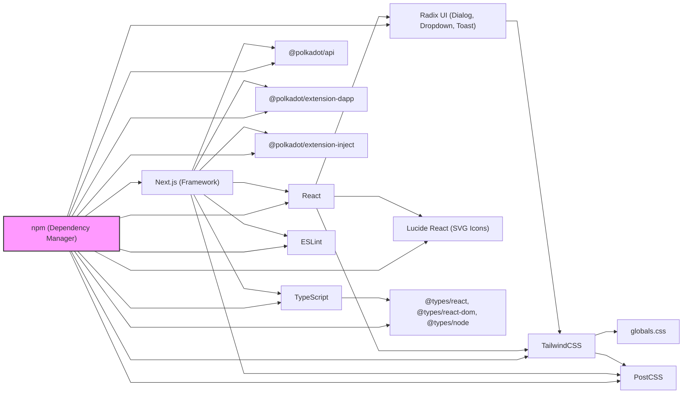

# Advanced Knowledge Base Management - SaaS Platform

## 🎯 Main Objective
Develop a SaaS platform for advanced knowledge base management, integrating RAG (Retrieval-Augmented Generation) with direct querying, focused on the Polkadot ecosystem and with potential for integration with digital wallets.

## 🏗️ Architecture & Technologies
- **Framework:** Next.js 15 with React 19
- **Styling:** Tailwind CSS 4 (standardized with polkadot-wallet)
- **Language:** TypeScript
- **Integration:** Polkadot Ecosystem
- **UI Components:** Radix UI + Lucide React
- **Pipeline:** RAG + MCP for hybrid data

## 📋 Development Standards
- **Components:** Functional React with hooks
- **Styling:** Tailwind CSS with standardized utility classes
- **Structure:** Organized by SaaS functionality
- **Responsiveness:** Mobile-first design
- **Accessibility:** WCAG standards
- **Automation:** Logs, commits, and automatic documentation

## 🎨 Design Guidelines
- **Interface:** Clean and minimalist (polkadot-wallet standard)
- **Colors:** Consistent palette with Polkadot identity
- **Typography:** Readable and hierarchical
- **Interactions:** Clear visual feedback
- **Loading:** Informative loading states

## 🛠️ Environment Settings
- **Auto-save:** Every 5 seconds
- **Versioning:** Git with frequent commits
- **Log:** Interaction and decision logging
- **Linting:** ESLint configured
- **Automation:** Standardized log and commit scripts

## 📁 Project Structure
```
Advanced-Knowledge-Base-Management/
├── src/
│   ├── components/     # Reusable components
│   ├── pages/          # SaaS pages
│   ├── styles/         # Standardized CSS
│   └── utils/          # Utilities (log, commit, etc.)
├── docs/               # Technical documentation
├── scripts/            # Automation scripts
├── public/             # Static assets
└── README.md           # This file
```

## 🚀 Workflow
1. **Context:** Always check this file before starting
2. **Task:** Consult the specific task file
3. **Development:** Follow established standards
4. **Log:** Record important decisions
5. **Commit:** Save changes to Git

## 📝 Important Notes
- **End user:** Developers and companies in the Polkadot ecosystem
- **Focus:** Simplicity and usability for knowledge management
- **Performance:** Fast loading and efficient processing
- **Security:** Secure integration with APIs and blockchains
- **Scalability:** Architecture ready for growth

## 🔗 Integration with Polkadot Wallet
- **Visual standardization:** Same color system and components
- **Authentication:** Via Polkadot wallets
- **Billing:** Payment system in DOT
- **API:** Endpoints for future integration

## 🛠️ Reusable Components
- **Log System:** Based on log-assistant.js
- **Commit Automation:** Standardized scripts
- **Documentation:** Templates and procedures
- **UI/UX:** Components based on polkadot-wallet

## 📊 Success Metrics
- **Performance:** Response time < 2s
- **Usability:** Intuitive interface
- **Scalability:** Support for multiple users
- **Integration:** Compatibility with the Polkadot ecosystem

## 🗺️ Roadmap
1. **Phase 1:** Base structure and components
2. **Phase 2:** Basic RAG pipeline
3. **Phase 3:** Integration with Polkadot APIs
4. **Phase 4:** Authentication and billing system
5. **Phase 5:** Integration with polkadot-wallet

---

## 🛠️ Technical & Operational Guidelines

This SaaS platform leverages a modern stack managed by **npm** (Node Package Manager), which controls the installation, versioning, and integration of all dependencies, ensuring seamless operation and easy updates.

### Main Dependencies
- **@polkadot/api:** Blockchain integration
- **@polkadot/extension-dapp:** Wallet extension connection
- **@polkadot/extension-inject:** Account injection and signing
- **@radix-ui/react-dialog, @radix-ui/react-dropdown-menu, @radix-ui/react-toast:** Accessible UI primitives
- **lucide-react:** SVG icons
- **next:** React framework
- **react:** UI library
- **react-dom:** DOM rendering
- **@tailwindcss/postcss, tailwindcss:** Utility-first CSS
- **typescript, @types/node, @types/react, @types/react-dom:** Type safety
- **eslint:** Code quality

### Dependency Visualization



### Integrity & Customization Directives
- Never modify the source code of external dependencies (Radix UI, TailwindCSS, etc.).
- All UI/UX customizations must be done via TailwindCSS utility classes, project-specific files (e.g., `globals.css`), Tailwind configuration, or React component composition.
- For advanced customization, use wrappers or hooks, but never alter files inside `node_modules`.
- When in doubt, consult this README or the project context documentation before deep customizations.

### For Future Adaptations
This README is designed to help contributors and collaborators understand both the technical context and operational procedures of this SaaS platform. Use it as a reference for future adaptations, forks, or collaborations, ensuring the project remains robust, maintainable, and easy to extend. This project is visually and technically aligned with polkadot-wallet, but is not a direct fork; it shares standards and components for maximum interoperability.

---

**Status:** 🟡 In early development
**Last update:** 2025-06-29
**Version:** 0.1.0

## Passos para garantir o CSS

1. Instale as dependências:
   ```bash
   npm install
   ```
2. Certifique-se de que existe o arquivo postcss.config.mjs na raiz do projeto:
   ```js
   const config = {
     plugins: ["@tailwindcss/postcss"],
   };
   export default config;
   ```
3. Rode o projeto normalmente:
   ```bash
   npm run dev
   ```

## 🛠️ Technical & Operational Guidelines

This SaaS platform leverages a modern stack managed by **npm** (Node Package Manager), which controls the installation, versioning, and integration of all dependencies, ensuring seamless operation and easy updates.

### Main Dependencies
- **@polkadot/api**: Blockchain integration
- **@polkadot/extension-dapp**: Wallet extension connection
- **@polkadot/extension-inject**: Account injection and signing
- **@radix-ui/react-dialog, @radix-ui/react-dropdown-menu, @radix-ui/react-toast**: Accessible UI primitives
- **lucide-react**: SVG icons
- **next**: React framework
- **react**: UI library
- **react-dom**: DOM rendering
- **@tailwindcss/postcss, tailwindcss**: Utility-first CSS
- **typescript, @types/node, @types/react, @types/react-dom**: Type safety
- **eslint**: Code quality

### Dependency Visualization


### Integrity & Customization Directives
- Never modify the source code of external dependencies (Radix UI, TailwindCSS, etc.).
- All UI/UX customizations must be done via TailwindCSS utility classes, project-specific files (e.g., `globals.css`), Tailwind configuration, or React component composition.
- For advanced customization, use wrappers or hooks, but never alter files inside `node_modules`.
- When in doubt, consult this README or the project context documentation before deep customizations.

### For Future Adaptations
This README is designed to help contributors and collaborators understand both the technical context and operational procedures of this SaaS platform. Use it as a reference for future adaptations, forks, or collaborations, ensuring the project remains robust, maintainable, and easy to extend. This project is visually and technically aligned with polkadot-wallet, but is not a direct fork; it shares standards and components for maximum interoperability. 