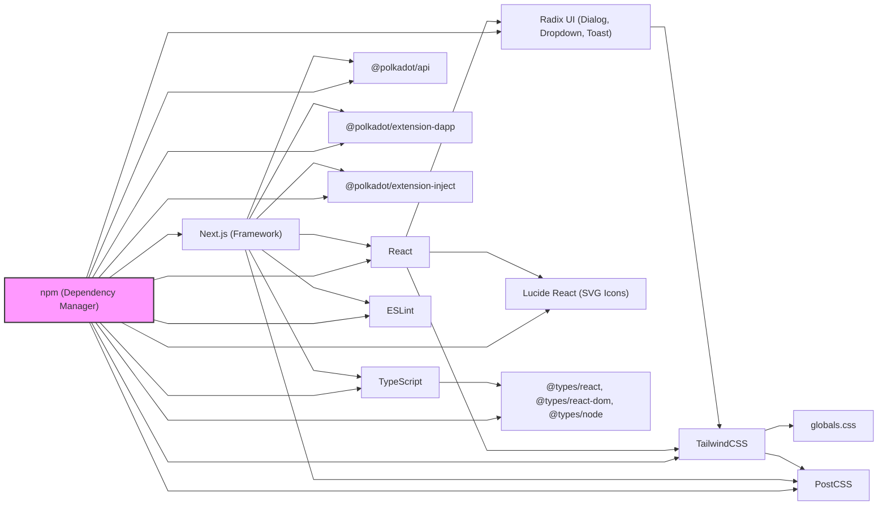

# Polkadot Wallet App

Uma aplicação Next.js para conectar e interagir com wallets Polkadot usando as bibliotecas oficiais do Polkadot.

## 🚀 Tecnologias Utilizadas

- **Next.js 15** - Framework React com App Router
- **TypeScript** - Tipagem estática
- **Tailwind CSS v4** - Framework CSS utilitário
- **Radix UI** - Componentes de interface acessíveis
- **@polkadot/api** - Biblioteca oficial para interagir com a blockchain Polkadot
- **@polkadot/extension-dapp** - Biblioteca para conectar com extensões de wallet
- **Lucide React** - Ícones modernos

## 📋 Pré-requisitos

Antes de começar, certifique-se de ter instalado:

1. **Node.js** (versão 18 ou superior)
2. **npm** (vem com o Node.js)
3. **Uma extensão de wallet Polkadot** (Polkadot.js, Talisman, SubWallet, etc.)

## 🛠️ Instalação

1. **Clone o repositório:**
   ```bash
   git clone <seu-repositorio>
   cd polkadot-wallet
   ```

2. **Instale as dependências:**
   ```bash
   npm install
   ```

3. **Execute o servidor de desenvolvimento:**
   ```bash
   npm run dev
   ```

4. **Abra o navegador:**
   Acesse [http://localhost:3000](http://localhost:3000)

## 🔗 Como Conectar sua Wallet

### 1. Instalar uma Extensão de Wallet

Você precisa ter uma das seguintes extensões instalada no seu navegador:

- **Polkadot.js Extension** - [Chrome](https://chrome.google.com/webstore/detail/polkadot%7Bjs%7D-extension/mopnmbcafieddcagagdcbnhejhlodfdd) | [Firefox](https://addons.mozilla.org/en-US/firefox/addon/polkadot-js-extension/)
- **Talisman** - [Chrome](https://chrome.google.com/webstore/detail/talisman-wallet/fijngjgcjhjmmpcmkeiomlglpeiijkld) | [Firefox](https://addons.mozilla.org/en-US/firefox/addon/talisman-wallet/)
- **SubWallet** - [Chrome](https://chrome.google.com/webstore/detail/subwallet/onhogfjeacnfoofkfgppdlbmlmnplgbn)

### 2. Criar ou Importar uma Conta

1. Abra a extensão de wallet
2. Crie uma nova conta ou importe uma existente
3. Certifique-se de que a conta está configurada para a rede Polkadot

### 3. Conectar no App

1. Clique no botão "Conectar Wallet"
2. Autorize a conexão na extensão quando solicitado
3. Selecione a conta que deseja usar
4. Visualize seu saldo e endereço

## 🏗️ Estrutura do Projeto

```
polkadot-wallet/
├── src/
│   ├── app/
│   │   ├── page.tsx          # Página principal
│   │   └── layout.tsx        # Layout da aplicação
│   └── components/
│       └── WalletConnect.tsx # Componente principal da wallet
├── public/                   # Arquivos estáticos
├── package.json             # Dependências e scripts
└── tailwind.config.ts       # Configuração do Tailwind
```

## 🔧 Funcionalidades

- ✅ Conectar com extensões de wallet Polkadot
- ✅ Listar contas disponíveis
- ✅ Selecionar conta ativa
- ✅ Exibir saldo em DOT
- ✅ Exibir endereço da conta
- ✅ Interface responsiva e moderna
- ✅ Desconectar wallet

## 🎨 Personalização

### Cores
As cores principais podem ser personalizadas no arquivo `tailwind.config.ts`:

```typescript
theme: {
  extend: {
    colors: {
      // Suas cores personalizadas aqui
    },
  },
},
```

### Componentes
Os componentes do Radix UI podem ser estilizados usando as classes do Tailwind CSS.

## 🚨 Solução de Problemas

### Erro: "Nenhuma conta encontrada"
- Verifique se você tem uma extensão de wallet instalada
- Certifique-se de que a extensão está ativa
- Tente recarregar a página

### Erro: "Erro ao conectar à rede Polkadot"
- Verifique sua conexão com a internet
- O endpoint RPC pode estar temporariamente indisponível

### Erro: "Erro ao buscar saldo"
- A conta pode não ter saldo
- Verifique se está conectado à rede correta

## 📚 Recursos Adicionais

- [Documentação do Polkadot API](https://polkadot.js.org/docs/api/)
- [Documentação do Polkadot Extension DApp](https://polkadot.js.org/docs/extension/)
- [Documentação do Next.js](https://nextjs.org/docs)
- [Documentação do Tailwind CSS](https://tailwindcss.com/docs)
- [Documentação do Radix UI](https://www.radix-ui.com/)

## 🤝 Contribuição

1. Faça um fork do projeto
2. Crie uma branch para sua feature (`git checkout -b feature/AmazingFeature`)
3. Commit suas mudanças (`git commit -m 'Add some AmazingFeature'`)
4. Push para a branch (`git push origin feature/AmazingFeature`)
5. Abra um Pull Request

## 📄 Licença

Este projeto está sob a licença MIT. Veja o arquivo `LICENSE` para mais detalhes.

## 🆘 Suporte

Se você encontrar algum problema ou tiver dúvidas, abra uma issue no repositório ou entre em contato.

## 🛠️ Technical & Operational Guidelines

This project uses a modern stack managed by **npm** (Node Package Manager), which controls the installation, versioning, and integration of all dependencies, ensuring seamless operation and easy updates.

### Main Dependencies
- **@polkadot/api**: Blockchain integration
- **@polkadot/extension-dapp**: Wallet extension connection
- **@polkadot/extension-inject**: Account injection and signing
- **@radix-ui/react-dialog, @radix-ui/react-dropdown-menu, @radix-ui/react-toast**: Accessible UI primitives
- **lucide-react**: SVG icons
- **next**: React framework
- **react**: UI library
- **react-dom**: DOM rendering
- **@tailwindcss/postcss, tailwindcss**: Utility-first CSS
- **typescript, @types/node, @types/react, @types/react-dom**: Type safety
- **eslint**: Code quality

### Dependency Visualization



### Integrity & Customization Directives
- Never modify the source code of external dependencies (Radix UI, TailwindCSS, etc.).
- All UI/UX customizations must be done via TailwindCSS utility classes, project-specific files (e.g., `globals.css`), Tailwind configuration, or React component composition.
- For advanced customization, use wrappers or hooks, but never alter files inside `node_modules`.
- When in doubt, consult this README or the project context documentation before deep customizations.

### For Future Adaptations
This README is designed to help contributors and collaborators understand both the technical context and operational procedures. Use it as a reference for future adaptations, forks, or collaborations, ensuring the project remains robust, maintainable, and easy to extend.

---

**Desenvolvido com ❤️ para o ecossistema Polkadot**
